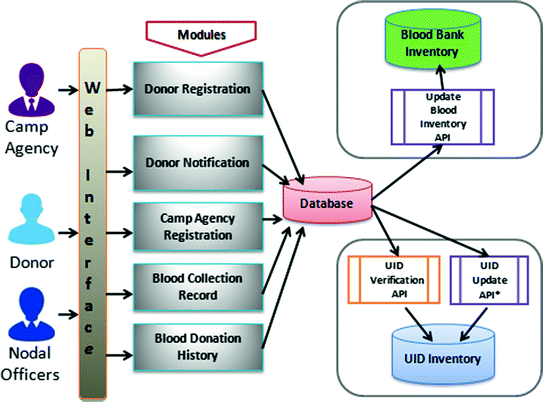
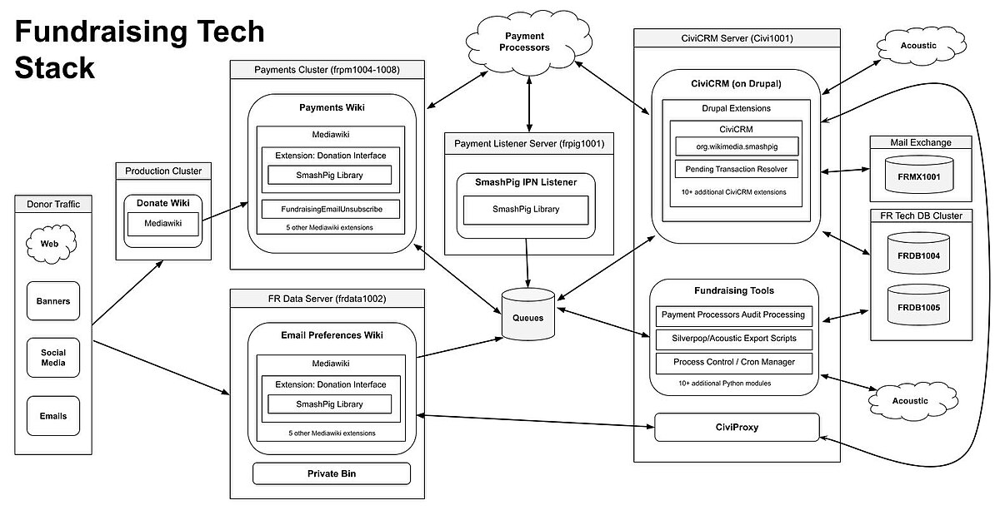
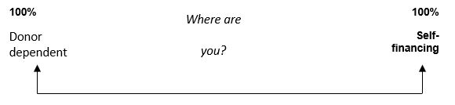

# Smart India Hackathon Workshop
# Date:25/11/24
## Register Number:24900214
## Name: Vishal S
## Problem Title
Implementation of the Alumni Association platform for the University/Institute.
## Problem Description
Background: Alumni associations play a pivotal role in fostering lifelong connections between graduates and their alma mater, facilitating networking, mentorship, and philanthropic support. However, many alumni associations face challenges in maintaining engagement, facilitating donations, and providing valuable services such as job networking and tracking alumni success stories. A comprehensive Alumni Association platform for a University/Institute, encompassing both web and mobile applications, aims to address these challenges effectively. Detailed Description: The proposed Alumni Association platform for the Government Engineering College will feature robust functionalities accessible through both web and mobile applications: Alumni Registration: User-friendly registration processes on both web and mobile platforms, allowing alumni to join the association, update their profiles, and stay connected with peers and the institution. Donation Portal: Secure mechanisms on both platforms for alumni to contribute donations easily and support various initiatives and projects undertaken by the college, fostering a culture of philanthropy. Networking Hub: Dedicated sections on both platforms to connect alumni based on shared interests, professions, and geographic locations, facilitating professional networking, mentorship, and collaboration opportunities. Job Portal: Integrated job search and posting features accessible via web and mobile apps, enabling alumni to explore career opportunities, post job openings, and connect with potential employers within the alumni network. Alumni Directory: Search functionalities available on both platforms to find alumni based on different criteria such as graduation year, field of study, industry, location, etc., promoting networking and community building. Success Story Tracking: Features on both web and mobile apps to showcase and track alumni achievements, success stories, and notable contributions to society, inspiring current students and fostering pride among alumni. Events and Reunions: Announcements, registrations, and management tools available on both platforms for organizing alumni events, reunions, workshops, and professional development sessions to maintain engagement and connection. Feedback and Surveys: Channels on both web and mobile apps for alumni to provide feedback on their experiences, suggest improvements, and participate in surveys to help shape future initiatives of the association. The platform will prioritize user experience, security, and scalability across both web and mobile applications to cater to the diverse needs of the Government Engineering College's alumni community. Expected Solution: Implementation of the Alumni Association platform for the Government Engineering College, comprising both web and mobile applications, is expected to achieve several positive outcomes: Enhanced Alumni Engagement: Seamless access to networking, career opportunities, and alumni events through web and mobile apps will strengthen connections among alumni, fostering a vibrant and active community. Increased Philanthropic Support: Convenient donation processes accessible via both platforms will encourage alumni to contribute towards the college's growth and development initiatives. Career Advancement: Access to job postings, mentorship opportunities, and professional networking on mobile devices will support alumni in their career growth and advancement. Knowledge Sharing: Exchange of knowledge, experiences, and best practices facilitated through both web and mobile apps will enrich professional development and lifelong learning initiatives. Pride and Recognition: Highlighting alumni achievements and success stories on both platforms will instill pride in the alma mater and inspire current students to excel in their academic and professional pursuits. Community Building: Interactive features available on both web and mobile apps will nurture a sense of belonging and camaraderie among alumni, strengthening their bond with the institution. In summary, the Alumni Association platform for the University/Institute, integrated with both web and mobile applications, aims to create a dynamic and supportive ecosystem where alumni can connect, contribute, and thrive, thereby enriching the overall educational experience and legacy of the institution.
## Problem Creater's Organization
Government of Gujarat

## Idea

Donation Portal:
Frontend: A donation form where alumni can choose donation amounts, payment methods, and specific funds to contribute to (e.g., scholarships, infrastructure, etc.).
Backend: Integrate with Stripe or Razorpay to process donations securely. Store donation details in the database for reporting and tracking purposes.
Mobile/Web Integration: Allow alumni to donate directly through web or mobile apps. Mobile apps will support mobile wallets and payment methods like Google Pay and Apple Pay.

## Proposed Solution / Architecture Diagram

## Use Cases

Donation portals have many use cases, including: 
Streamlining the donation process: Donation portals can help make donating easier and more efficient. They can also help organizations better understand donors' needs, which can lead to more consistent giving. 
Improving donor communication: Donation portals can help organizations improve communication with donors. 
Tracking donations: Donation portals can help organizations track donations more effectively. 
Increasing donation accessibility: Donation portals can increase donation accessibility and participation by allowing donors to make donations anytime, anywhere. 
Automating administrative tasks: Donation portals can streamline donation processing and receipt issuing, which can reduce manual efforts for charities. 
Increasing efficiency: Donation portals can help organizations increase efficiency by reducing the amount of time that staff and volunteers spend answering questions and providing resources. 
Donation portals can also offer features such as: Recurring donation options, Customizable giving levels, Built-in e-commerce features, and Campaign planning and budgeting. 
Some examples of donation portals include: 
Knack: Offers an online donation portal template with built-in e-commerce features 
Tradly: Offers a donation portal template that can be customized 
Classy: A nonprofit online fundraising platform 
Bonfire: An online fundraising platform that offers a reduced processing fee for verified nonprofits 

## Technology Stack

## Dependencies
This is not a stark choice: full financial self-sufficiency or total donor dependence.  And we must not forget that donor organisations do exist to provide funding.

When considering financing strategies, your NGO may opt for a strategy somewhere in between the two extremes.  One approach is to meet operating overheads (rent, staff salaries, maintenance costs, utility bills, etc.) through fundraising activities, and to finance programme costs through conventional donor sources. 
In this way an NGO can more fully integrate itself into its local community, maintaining control over its long-term operational and strategic development, and access sources of external finance only for programme-specific activities.

Setting targets
A good starting point is to identify how donor dependent your NGO currently is and how long it could survive if all its external aid were suddenly withdrawn.  We can use what is known as ratio analysis to do this – see the formulas below.
Taken together with other information, these indicators will give a picture of the financial vulnerability status of the organisation.  You can then set targets for improvement in say, 5 years’ time.
Clearly, an NGO which is 100% donor dependent with sufficient funds to last approximately 10 days, is a lot less sustainable than one which is 50% dependent and has enough to keep going for 90 days.
The ideal target will depend on your own NGO’s circumstances but once established, this can be used to guide the financing strategy.
To calculate where you are now, you will need the latest set of annual financial statements – i.e. the financial report including a Balance Sheet and an Income and Expenditure (sometimes called Profit & Loss) statement.
To calculate the ‘Donor Dependency’ ratio:
TOTAL DONOR INCOME   x 100   [result will be expressed as %]
TOTAL INCOME
To calculate the ‘Survival Ratio’ ratio:
GENERAL RESERVES*    x 52 or x 365       [result will be expressed in weeks or days]
TOTAL INCOME
*  General Reserves are the unrestricted reserve funds saved up since the organisation began.  They will be listed on the Balance Sheet and may also be referred to as General Purposes Funds or General Funds.  If you cannot find this figure, use the figure for ‘Net Current Assets’ instead.

There is no easy formula for deciding the optimum level of financial autonomy for an NGO: it depends on what is desirable and achievable by the NGO concerned

